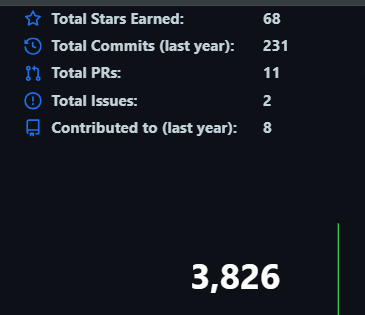
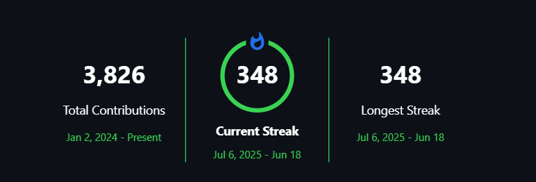

# gh-boost

Fills your GitHub contribution graph with backdated commits, real issues, and merged pull requests — all against a repo you own.

Activity is modeled on how real developers actually work: focus runs of a few days, short breaks in between, longer gaps for holidays and summer, quieter months in January and December, weekends mostly empty.

---

## Setup

**1. Create a fresh empty repo on GitHub**

Go to github.com/new, give it any name, and leave it completely empty. No README, no license, no .gitignore.

**2. Get the files**

Download this project as a ZIP and extract it, or clone it into a temporary folder:

```bash
git clone https://github.com/YOUR_USERNAME/gh-boost.git
cd gh-boost
```

Then wipe its own history and point it at your new empty repo:

```bash
npm run reset
```

This clears the cloned history and pushes a blank slate to your repo before the real run begins. Skip this if you downloaded the ZIP.

**3. Install dependencies**

```bash
npm install
```

**4. Create a GitHub token**

Go to **github.com/settings/tokens** and generate a **fine-grained personal access token**:

- Set repository access to your new empty repo only
- Grant: **Contents** (read/write), **Issues** (read/write), **Pull requests** (read/write)

Alternatively, generate a **classic token** with the `repo` scope (broader access, simpler to set up).

Copy the token value and set it in your terminal:

```powershell
# PowerShell
$env:GITHUB_TOKEN="ghp_xxxxxxxxxxxx"
```

```bash
# CMD
set GITHUB_TOKEN=ghp_xxxxxxxxxxxx

# Mac or Linux
export GITHUB_TOKEN=ghp_xxxxxxxxxxxx
```

**5. Run**

```bash
npm start
```

Takes 15 to 30 minutes. Check your profile once it finishes.

---

## Commands

| Command | What it does |
|---|---|
| `npm start` | Full run -- commits, issues, and PRs |
| `npm run dry` | Preview the plan, no writes |
| `npm run reset` | Wipe history, then full run |
| `npm run commits` | Commits and push only, no issues or PRs |

**CLI flags** (for running `node run.js` directly):

| Flag | Effect |
|---|---|
| `--dry` | Show the plan without writing anything |
| `--reset` | Wipe git history first, then run |
| `--no-gh` | Skip issue and PR creation |

---

## Configuration

Open `config.js`. It is the only file you need to change.

**Set the years on your graph:**

```js
profile: [
  { yearsAgo: 2, era: "new"     },  // two years ago -- sparse, just starting
  { yearsAgo: 1, era: "growing" },  // last year     -- more consistent
  { yearsAgo: 0, era: "active"  },  // this year     -- active, up to today
]
```

**Change the streak length:**

```js
streak: { days: 103 }   // consecutive days ending yesterday
```

**Change issue and PR counts:**

```js
github: { issueCount: 30, prCount: 10 }
```

**Skip issues and PRs:**

```js
github: { enabled: false }
```

---

## If something goes wrong

If the run is interrupted (Ctrl+C, network failure, power loss), you will have partial history. Clean up with:

```bash
npm run reset
```

This wipes everything and lets you start fresh.

---

## Environment variables

| Variable | Required | Description |
|---|---|---|
| `GITHUB_TOKEN` | Yes, for issues/PRs | Personal access token |
| `GITHUB_OWNER` | No | Your GitHub username (auto-detected from remote) |
| `GITHUB_REPO` | No | Target repo name (auto-detected from remote) |

`GITHUB_OWNER` and `GITHUB_REPO` are only needed if auto-detection from the git remote fails.

---

## What gets generated

| Type | Default | Counts on profile |
|---|---|---|
| Backdated commits | ~300-500 | yes |
| Issues opened | 30 | yes |
| Pull requests merged | 10 | yes |

**Built-in natural patterns:**

- Work runs of 2-6 days with 1-3 day rests in between (not random per-day coin flips)
- Calendar-aware gaps: winter holidays, summer break in July/August, a spring and autumn trip
- Month density: April/May/October most active, January/December lightest
- Saturdays ~15%, Sundays ~4%
- Commits between 9am and 10pm, weighted toward afternoon

**Note:** Files in `content/` are regenerated on every run. Do not manually edit them.

---

## Files

```
config.js   -- edit this
run.js      -- entry point
profile.js  -- generates the commit schedule
commits.js  -- file changes and git operations
github.js   -- issues and PRs via the GitHub API
content/    -- files changed per commit (auto-created, do not edit)
```

---

## Output




---
<br/>

**Keywords:**
#gh-boost #github-activity #github-contributions #contribution-graph #github-bot #commit-generator #developer-tools #github-profile #automation #seo #github-streak

